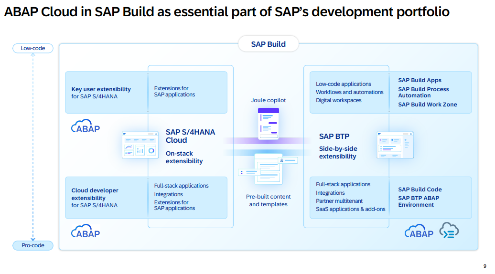

# Briefing 40. SAP Stammtisch Magdeburg - 24.11.2025

## Einleitung

Der SAP Stammtisch Magdeburg hatte 2018 sein erstes Treffen in Magdeburg. Die Idee ist spontan auf dem DSAG Jahreskongress entstanden, als wir mit ca. 20 Personen aus Magdeburg und Umgebung beim Mittagessen in einer "Traube" standen. 

Dort haben wir bechlossen, es einfach mal mit einem regionalen SAP Stammtischtreffen zu versuchen. Beim ersten Treffen waren wir ca. 25 Personen. Das hat uns motiviert, diese Idee fortzusetzen. 

Unsere Regel "wir treffen uns am letzten Montag im ungeraden Monat" haben wir bis auf wenige Ausnahmen bis heute durchgehalten. 

Durch Corona mussten wir uns die Frage stellen, ob und wie es weitergehen könnte. Nach einer kurzen Findungsphase haben wir uns für virtuelle Treffen entschieden. Dieses Angebot haben auch überegionale Gäste wahrgenommen, vor allem von anderen SAP Stammtischen.

Als wir uns dann wieder "normal" treffen konnten, wollten wir unser überegionales "Stammpublikum" behalten und haben hybride Treffen angeboten. Das hat meistens gut funktioniert und so sind wir bis heute dabei geblieben.

## Wie laufen die Treffen ab?

In den meisten Fällen treffen wir uns beim SAP University Competence Center Magdeburg (SAP UCC) am Uniplatz Magdeburg. Wir werden manchmal auch zu Unternehmen der Region eingeladen.

Die Treffen starten meistens ab 18:30 Uhr für Vor Ort Gäste. Die virtuellen Gäste werden ab 19:00 Uhr über Zoom, Teams o.ä. Tools virtuell zugeschaltet.
Schluss ist so zwischen 21:00 - 22:00 Uhr je nach Tagesform.

Vor Ort sorgen wir für Snacks und Getränke. Die Kosten werden von den SAP Stammtisch Sponsoren oder von den Unternehmen getragen, wo wir zu Gast sind. 
Deshalb startet unser Stammtisch für virtuelle Gäste etwas später und wir benötigen immer ein kurze Pause für die "Nachversorgung" der Teilnehmer.  

Unser Publikum ist häufig bunt gemischt. Es sind natürlich hauptsächlich Personen von SAP Kunden- oder Beratungsunternehmen aus den Bereichen Basis, Entwicklung und Consulting. Aber wir haben immer mal wieder Besuch aus dem Non-SAP Bereich und konnten schon mehrfach Vertriebsmitarbeiter, Geschäftsführer und Personen aus anderen Unternehmensbereichen begrüßen, die nicht unbedingt typisch für diese Art von eher technischen Stammtischen sind. 

Daher haben wir uns bei den Treffen eher an typischen DSAG Arbeitskreistreffen orientiert: 2-3 Vorträge meistens zu einem Schwerpunktthema mit viel Raum für den Austausch. Gern auch mit einem Blick über den SAP Tellerrand.

## Informationen zum nächsten SAP Stammtisch Magdeburg

### Organisatorisches

- Termin: Montag, 24.11.2025
- Start des virtuellen Meetings: 19:00 Uhr
- Ende: ca. 21:30 Uhr  
- mindestens eine kleine Pause von 5-10 Minuten 
- aktuelle Informationen und Link zum virtuellen Meeting auf https://sapstammtisch.github.io/Magdeburg/
- Kontaktaufnahme mit den Organisatoren: direkt über Euren Ansprechpartner und vereinbarten Kanal oder per E-Mail an magdeburg@sapstammtisch.org
- Wir werden die Veranstaltung hauptsächlich bei Linkedin bewerben und freuen uns über weitere Verteilung durch Euch
- Eine Anmeldung für Vor-Ort-Teilnehmer ist erwünscht und wird voraussichtlich über Meetup organisiert (von IN4MD Service, Babett)

### Motto

Am 24.11.2025 ist tatsächlich unser 40. Stammtisch und damit ein Jubiläum. Wir hatten im Vorfeld bereits das Motto entschieden: ***"Was macht die SAP Entwicklung von morgen?"***. 

Der vorherige SAP Stammtisch hatte das Motto: "Was macht die SAP Basis von morgen?" und wurde gut angenommen. 

Für unser Jubiläum hatten wir die Idee, dass wir eine Art virtuelle Podiumsdiskussion veranstalten und uns interessante Gäste zum Thema einladen.

Wir haben uns ein paar Fragen zum Motto überlegt, über die wir mit unseren eingeladenen Gästen aber auch mit dem Publikum vor Ort und virtuell diskutieren wollen. Wir haben diese Fragen zur Orientierung separat aufgeführt (siehe unten).

### Ablauf

Babett und Jörg machen als Organisatoren den "Aufschlag" mit kurzen Impulsvorträgen und wechseln dann in die Rolle der Moderatoren. Danach kommen die Gäste nacheinander zu Wort. Jeder darf sich, sein Unternehmen bzw. Projekt und wie er über die Zukunft der SAP Entwicklung denkt, vorstellen. 

Jeder Gast bringt außerdem ein Thema im Rahmen eines kurzen **Impulsvortrags** mit, welcher irgendwie zum Motto passt. Das kann beispielsweise die Vorstellung eines Opensource Projektes, eine Buchvorstellung, ein Erfahrungsbericht aus dem Projektalltag o.ä. sein. 

Also irgendwas, was die Teilnehmer interessieren könnte und worüber wir dann noch diskutieren können. Einige Fragen am Ende sollten berücksichtigt werden. Es gibt ggf. noch die Möglichkeit, einige dieser Fragen am Ende als Teil der Diskussion zu beantworten. 

Wir planen für jeden Gast zwischen 10 und 20 Minuten ein und werden als Moderatoren etwas auf die Einhaltung der Zeit achten. Wenn alle Gäste an der Reihe waren, haben wir sehr wahrscheinlich einige Ansatzpunkte, um die von uns gewünschte Diskussion fortzuführen. 

Analog einer Talkshow werden die Moderatoren die vorab bekannten Fragen noch einmal in der großen Runde stellen, falls diese zuvor noch nicht ausreichend behandelt wurden. Jeder Gast bekommt so weitere Redezeit und wir können ggf. auch weitere Fragen und Perspektiven verfolgen. Die Einbindung des Publikums ist jederzeit möglich. 

Die Moderatoren versuchen diese Diskussion und den damit verbundenen Austausch etwas zu steuern. In der Vergangenheit war es häufig so, dass wir eine sehr lebhafte Diskussion entfachen konnten, die wir dann nicht unterbrohen haben. Dieses Mal werden wir das so ähnlich machen. Ausnahme: wir kommen zu weit vom Thema ab.

### Roter Faden

Wir werden voraussichtlich die folgende SAP Grafik aus der aktuellen [Clean Core Extensibility Strategy, S.9](https://d.dam.sap.com/a/gisw4N2/Clean_Core_Extensibility_Strategy_powered_by_ABAP_Cloud_and_Generative_AI.pdf?rc=10) als roten Faden für unsere kleine Reise durch die mögliche zukünftige SAP Entwicklung verwenden. Start oben durch die Moderatoren und dann im Uhrzeigersinn. Am Ende eine Zusammenfassung "von unten" und Start der übergreidenen Diskussion.

Ihr könntet ebenfalls diese Grafik verwenden, um Eure Perspektive und Euren Impulsvortrag einzuordnen. Teilt uns am besten Eure eigene Einordnung vorher mit, damit dann die vorgesehene Reihenfolge passt.

## Unsere Fragen

Hier ein paar Fragen, die wir im Rahmen des Stammtisches ansprechen werden und uns über verschiedenen Meinungen und Perspektiven freuen:

- Wie sieht die Zukunft für SAP Entwickler aus?
- Welche Rolle spielt ABAP in der Zukunft?
- Welche Programmiersprachen oder Technologien werden zukünftig (noch) gebraucht?
- Welche Skills brauchen SAP Entwickler?
- Wie wird die KI die Arbeit von SAP Entwicklern unterstützen?
- Wohin wird sich SAP und das Kernprodukt ERP entwickeln?
- Wie werden die Kunden das SAP Kernprodukt ERP zukünftig nutzen (und anpassen)?
- Welche anderen Produkte und Technologien werden relevant für SAP Entwickler?

Die Fragen könnten sich ggf. noch ändern bzw. ergänzt werden. Die grobe Richtung wird allerdings bleiben.

## Anregungen für Euren Impulsvortrag

Hier ein paar Anregungen für Euch, wie Ihr Euren Beitrag aufbauen könntet:

1. Wer seid Ihr?
2. In welcher Rolle seid Ihr bei uns?
3. Welchen Impuls habt Ihr uns mitgebracht und warum?
4. Euer Impulsvortrag
5. Wie seht Ihr persönlich die Zukunft der SAP Entwicklung: Eure Meinung und oder Perspektive?
6. Beantwortung von Fragen aus dem Publikum

Denkt daran, dass wir am Ende in der großen Runde gemeinsam diskutieren wollen. Ihr könnt Euren Vortrag dazu nutzen, um Themen für diese Diskussion am Ende zu platzieren und ggf. dafür sogar zusätzliche Folien "in der Tasche" haben.

## Abschließende Bemerkungen

Wir freuen uns, wenn wir mit Euch zusammen einen interessanten Abend gestalten können und damit auch übergreifende Aufmerksamkeit für das Format "SAP Stammtisch" erreichen. Solltet Ihr einen Bezug zu einem anderen regionalen SAP Stammtisch o.ä. Community Format haben, könnt Ihr selbstverständlich Werbung dafür machen.

Wir überlegen derzeit noch, ob wir die Veranstaltung aufzeichnen und im Nachgang über Youtube o.ä. für alle (ggf. geschnitten) zugänglich machen. Eine Entscheidung steht noch aus und Ihr könnt uns gern im Vorfeld Eure Meinung mitteilen. 

Falls Ihr noch Anregungen oder Fragen habt, kommt bitte auf uns zu.

Vielen Dank im Voraus!

---
last modified: 27.10.2025, mdjoerg