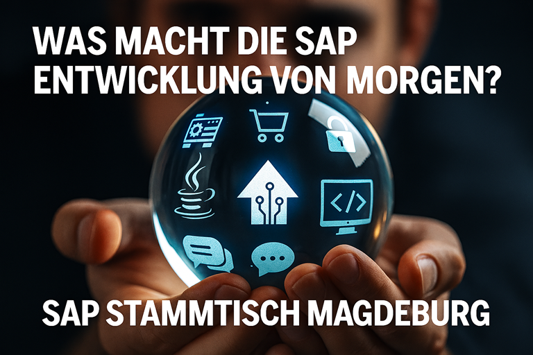

# Willkommen zu den öffentlichen Ressourcen vom SAP Stammtisch Magdeburg

## SAP Stammtisch Magdeburg
Der SAP Stammtisch Magdeburg ist ein regelmäßiges Treffen der lokalen SAP Community. Egal, welches Modul Ihr betreut, egal ob Entwickler, Administrator, Anwender oder Berater, alle sind herzlich eingeladen. Der Erfahrungsaustausch rund um SAP wie auch alle Nicht-SAP-Themen steht im Mittelpunkt.

Unsere Treffen sind immer am letzten Montag im ungeraden Monat. Normalerweise treffen wir uns im [SAP University Competence Center (SAP UCC) am Universitätsplatz 12, Magdeburg](https://maps.app.goo.gl/BaQuaCSnDzYChWbK6). Manchmal sind wir auch zu Gast bei regionalen Unternehmen und Organisationen. Seit 2022 sind wir dazu übergegangen, hybride Meetings durchzuführen. 

## Aktuelles - Nächstes Treffen

**Schwerpunktthema: "Was macht die SAP Entwicklung von morgen?"**

### Organisatorisches

- Termin: 24.11.2025 - Hybrid:
- 18:30 Uhr Einlass im SAP UCC
- 19:00 Start der Vorträge und des virtuellen Meetings
- 21:30 voraussichtliches Ende des offiziellen Teils
- [Anmeldung - Vor Ort Gäste (EventBrite)](https://www.eventbrite.de/e/sap-stammtisch-magdeburg-1125-was-macht-die-entwicklung-von-morgen-tickets-1951679569129?aff=oddtdtcreator)
- [Anmeldung - virtuelle Gäste (LinkedIn)](https://www.linkedin.com/events/sapstammtischmagdeburg11-25-was7391108876315828224/)
- [Link zum virtuellen Meeting](https://teams.microsoft.com/l/meetup-join/19%253ameeting_YjkxODcyZjAtNzEzMi00ZTMxLWI1ZDItNjUyZmEzNTM2M2Nk%2540thread.v2/0?context%3D%257b%2522Tid%2522%253a%25225b0fd754-bbbe-45ed-8c4a-d39f92a252a5%2522%252c%2522Oid%2522%253a%252219034815-6841-408f-be29-a58fae8c9273%2522%257d&sa=D&source=calendar&ust=1762238238837110&usg=AOvVaw1uihtmrEUVu4LrjPu7VJTX) 

### Informationen zum Ablauf

Der nächste SAP Stammtisch ist unser **40. Treffen**. Zum **Jubiläum** wollten wir wieder etwas Besonderes machen. 

Wir haben uns interessante **Gäste** zu unserem Schwerpunktthema *"Was macht die SAP Entwicklung von morgen?"* eingeladen (teilweise virtuell).  

Jeder Gast bringt einen kurzen **Impulsvortrag** mit, der sich irgendwie um die Entwicklung im SAP Umfeld dreht. Natürlich sind wir gespannt darauf, welche **Perspektiven und Erwartungen** unsere Gäste zur **zukünftigen SAP Entwicklung** mitbringen werden.

Im Anschluss an die Impulsvorträge wechseln wir in den Modus der **virtuellen Podiumsdiskussion**. Zusammen mit Euch wollen über die Zukunft der SAP Entwicklung diskutieren. Die Magdeburger Stammtischorganisatoren Babett und Jörg moderieren den Abend.

**Fragen**, die wir uns im Vorfeld überlegt haben:

1. Wohin wird sich SAP und das Kernprodukt ERP entwickeln?
2. Wie werden die Kunden das SAP Kernprodukt ERP zukünftig nutzen (und anpassen)?
3. Welche anderen Produkte und Technologien werden relevant für SAP Entwickler?
4. Wie sieht die Zukunft für SAP Entwickler aus?
5. Welche Rolle spielt ABAP in der Zukunft?
6. Welche Programmiersprachen oder Technologien werden zukünftig (noch) gebraucht?
7. Welche Skills brauchen SAP Entwickler?
8. Wie wird die KI die Arbeit von SAP Entwicklern unterstützen und ggf. verändern?

Unsere (vorläufige) **Gästeliste**:
- Jörg Brandeis, Buchautor und Trainer, SAP Stammtisch Karlsruhe
- Martin Fischer, DSAG Partnerbeirat und Podcaster, SAP Stammtisch Stuttgart
- Fabian Lupa, Buchautor und Trainer, SAP Stammtisch Dortmund
- Kevin Pocher, Lead Developer, SAP Stammtisch Magdeburg (Halle/Leipzig)
- Björn Schulz, SAP Mentor und Content Creator, SAP Stammtisch Düsseldorf-Köln  
- Gregor Wolf, SAP Mentor und Developer, SAP Stammtisch München

Wir freuen uns, dass unsere Gäste ausnahmslos bei anderen regionalen SAP Stammtischen engagiert sind.

### Sonstige Informationen

Mit unseren hybriden Events versuchen wir unsere gern gesehenen überregionalen Gäste virtuell zu integrieren. Bitte beachten, dass wir virtuell erst ab ca. 19:00 Uhr mit der Übertragung starten. Die Vor-Ort-Veranstaltung beginnen etwas eher (Einlass ab 18:30 Uhr).

Es besteht keine Anmeldepflicht. Allerdings könntet Ihr Euch freiwillig auf der [SAP Community Event Kalender Seite](https://groups.community.sap.com/t5/sap-stammtisch/eb-p/stammtisch) anmelden und damit zeigen, dass unser SAP Stammtisch "Community lebt". Vielen Dank!

Wir freuen uns auf Euren Besuch! 

## Der SAP Stammtisch Magdeburg im Internet

- [Mastodon: #SAPStammtischMD](https://machteburch.social/@SAPStammtisch)
- [X: #SAPStammtischMD](https://www.x.com/hashtag/sapstammtischmd)
- [BlueSky: #SAPStammtischMD](https://bsky.app/hashtag/sapstammtischmd)
- [SAP Community Gruppe Magdeburg](https://groups.community.sap.com/t5/magdeburg/gh-p/magdeburg)
- [SAP Community Events - SAP Stammtische](https://groups.community.sap.com/t5/sap-stammtisch/eb-p/stammtisch)
- [SAP Community Event Kalender](https://groups.community.sap.com/t5/events/ct-p/events)

## Sonstige Informationen im Internet
- [SAP Stammtische auf Github](https://sapstammtisch.github.io/welcome/)
- [SAP Stammtisch Bern und virtuell Schweiz](https://wiki.scn.sap.com/wiki/display/events/SAP+Stammtisch+Bern+und+virtuell+Schweiz)
- [SAP Stammtisch Projekt GUSBAD "Gute und schlechte Beispiele aus Digitalisierungsprojekten"](https://sapstammtisch.github.io/gusbad/)

## Archiv - bisherige Treffen und Dokumente

### 2025

- 24.11.2025 - #40 - Vor-Ort SAP UCC Hybrid: Schwerpunkt "Was macht die SAP Entwicklung von morgen?"
    - [Briefing](20251124_briefing.md)

- 29.09.2025 - #39 - Vor-Ort SAP UCC Hybrid: Schwerpunkt "Was macht die Basis von morgen?"
    - [Von der Tradition zur Innovation](archiv/20250929/20250929_sap_stammtisch_md_in4md_dsag_tradition_innovation.pdf), Babett, IN4MD Service
    - [Die Odoo Story](archiv/20250929/20250929_sap_stammtisch_md_initos_Odoo_Story.pdf), Frederik, initOS
    - [AIOps für traditionelle SAP-ERP-Systeme](archiv/20250929/20250929_sap_stammtisch_md_tsystems_AIOpsV1.pdf), Lars, T-Systems

- 17.02.2025 - #38 - Vor-Ort SAP UCC Hybrid: Schwerpunkt "Zukunftstrends"
    - [Rückblick Zukunftstag Produktion](archiv/20250217/20250217_Rückblick_Zukunftstag_Produktion_Elbfabrik.pdf) - Jörg, BA
    - Databricks Backstage mit Live Demo - Robert, UT
    - [Nachhaltigkeit - Notwendigkeit und Chancen](archiv/20250217/20250217_SAP_Sustainability.pdf) - Stefan, UCC 
    - [Teaser](archiv/20250217/20250217_teaser.png)

### 2024

- 25.11.2024 - #37 - Vor-Ort SAP UCC Hybrid: Schwerpunkt "KI für Alle"
    - [KI Einleitung](archiv/20241125/20241125_SAP_Stammtisch_Magdeburg_Einleitung.pdf) - Jörg, BA 
    - [KI - Zwischen Mythos und Realität](archiv/20241125/20241125_SAP_Stammtisch_Magdeburg_Part_Mario.pdf) - Mario, Regiocom
    - [KI für KMU by IONOS](archiv/20241125/20241125_IONOS_KI_für_KMU.pdf) - Ben, IONOS - [Whitepaper AI Model Hub](archiv/20241125/Whitepaper_IONOS_AI_Model_Hub.pdf)
    - [Aktuelle Forschungsthemen und Zukunftsperspektiven im Bereich der KI](archiv/20241125/20241125_SAP-Stammtisch_SLang.pdf) - Sebastian, OvGU

- 30.09.2024 - #36 - Vor-Ort Fraunhofer Elbfabrik Hybrid: Schwerpunkt "Datenräume"
    - Datenräume - Tobias (IFF)
    - Vom monolithischem System zur hybriden Cloud Landschaft und dem Daten-Management - Jens (BA)
    - Konzept Barcamp 2025 - Stefan (MDZMD)
    - [Teaser](archiv/20240930/20240930_teaser.jpg)
      
- 29.07.2024 - #35 - Vor-Ort S4Campus - Sommertreffen mit Brainstorming zum Hackathon

- 27.05.2024 - #34 - Hybrid: zu Gast bei Regiocom: Schwerpunkt "Energiewirtschaft"
    - [Teaser](archiv/20240527/teaser_regiocom.jpg) 
    - [Markstammdatenregister (MaStR), Regiocom](archiv/20240527/20240527_SAP_Stammtisch_Magdeburg_MaStR.pdf)
    - [SAP MaCo Cloud Testdatenerzeugung mit dem J-EDI Creator, Regiocom](archiv/20240527/J-EDI-Creator_Produktpräsentation_SAP_Stammtisch.pdf)
    - Regionale Aktivitäten Energie und Digitalisierung, MDZM u.a.
        - [Vorstellung Mittelstand-Digital Zentrum Magdeburg mit Praxisbeispiel](archiv/20240527/Vorstellung-MDZMD-Plus-Energiemgmt-2024-05-27.pdf)
        - [Vorstellung Projekt KEDi Kompetenzzentrum Energieeffizienz](archiv/20240527/20240527_KEDi_Vorstellung_SAP-Stammtisch.pdf)
        - [Messebericht Hannover Messe 2024 Digital Product Passport (DPP), Verwaltungsschale (AAS)](archiv/20240527/20240426_HMI-Messebericht%20P.Schreiber.pdf)

- 25.03.2024 - #33 - Hybrid im SAP UCC: Schwerpunkt "Vertriebsunterstützung"
    - [Teaser](archiv/20240325/teaser.png)
    - [Vortrag CRM Theorie](archiv/20240325/20240325_vSAP_Stammtisch_Magdeburg_CRM.pdf)
    - [Vortrag Trumpf](archiv/20240325/20240325_SAP_Stammtisch_Magdeburg_Trumpf.pdf)

- 29.01.2024 - #32 - Hybrid im SAP UCC: Schwerpunkt "SAP Fachkräfte"
    - [Teaser](archiv/20240129/teaser.gif)
    - [Vortrag IN4MD - BA Ausbildungsakademie](archiv/20240129/Ausbildungsakademie_BR.pdf)
    - [Vortrag IFA - Multidimensional Corporate Analysis](archiv/20240129/LucaNet_Success_Roadmap.pdf)

### 2023

- 27.11.2023 - #31 - Hybrid im SAP UCC: Schwerpunkt "Mixed Reality"
    - [Agenda und Infos](archiv/20231127/Agenda_und_Infos.pdf)
    - [Vortrag Datenmigration](archiv/20231127/BA_Datenmigration.pdf)
    - Vortrag 3DQR:
        - [Trainingsunterlagen Deutsch](archiv/20231127/3DQR_Training.pdf)
        - [3D QRCode für SAP Stammtisch](archiv/20231127/3DQR_Code.pdf)
        - Use Cases für die Diskussion siehe [Agenda und Infos](archiv/20231127/Agenda_und_Infos.pdf)

- 25.09.2023 - #30 - Hybrid: Zu Gast im Fraunhofer Institut für Fabrikbetrieb und -automatisierung (IFF)
    - Vortrag IFF: Vorstellung der Elbfabrik: [Homepage](https://www.elbfabrik-magdeburg.de/) und [Demonstratoren](https://www.elbfabrik-magdeburg.de/demonstratoren/)
    - Vortrag BA: Digitale Produktion - Praxiserfahrungen: [Vortrag](archiv/20230925/20230925_Digitale_Produktion_BA.pdf)
    - Vortrag Regiocom: MLOps in der Produktion: [Vortrag](archiv/20230925/20230925_MLOps_SAP_Stammtisch.pdf)

- 31.07.2023 - #29 - Vor Ort Treffen im Hyde

- 12.06.2023 - #28 - Hybrid: UCC - Schwerpunkt Unsere Zukunft in IT Service und Betrieb
    - Vortrag UCC/IN4MD: Die FocusedRUN Strategie und Status Quo Solution Manager
    - Vortrag T-Systems: Multi-Cloud-Management: [Vortrag](archiv/20230612/20230612_T-Systems_MultiCloudManagement_SAP_Stammtisch.pdf)

- 27.03.2023 - #27 - Hybrid: Zu Gast bei SWM (Städtische Werke Magdeburg)
    - Vortrag SWM: Einsatz der SAC als Grundlage für die Analyse von Netzstörungen
    - Vortrag UCC: Bereitstellung einer SAC Mehrmandantenlandschaft für die Ausbildung - Erfahrungen

- 30.01.2023 - #26 - Hybrid: UCC - Schwerpunktthema "Citizen Developer - Vision oder Fiktion"
    - [Agenda und Infos](archiv\20230130\20230130 vSAP Stammtisch Magdeburg #26 Agenda und Infos.pdf)
    - Vortrag Low Code mit SAP: [Video](https://youtu.be/oWl1BHiRHFc)
    - Vortrag Low Code mit Neptune: [Video](https://youtu.be/PcTZ2J0NoGo), [Vortrag](archiv\20230130\20230130 SAP Stammtisch MD - What convinced me as an SAP developer that Low-code is a good thing.pdf)
    - Vortrag Low Code mit Microsoft: [Video](https://youtu.be/9CURuOHpg7s)
    - Vortrag Low Code mit Odoo: [Video](https://youtu.be/ocZLwBzpyjA)

### 2022
- 28.11.2022 - #25 - Hybrid: UCC 
    - [Agenda und Infos](archiv\20221128\Agenda_und_Infos.pdf)
    - Vortrag Kooperationen zwischen Wissenschaft und Wirtschaft ([Folien](archiv\20221128\SAP_NextGen.pdf), [Aufzeichnung](https://youtu.be/lySmE0KPjRg))
    - Vortrag Business Hackathon und Data Science ([Folien](archiv\20221128\Business_Hackathon_und_Data_Science.pdf), [Aufzeichnung](https://youtu.be/mFU2uPHorXE))
- 26.09.2022 - #24 - Hybrid: UCC 
    - [Agenda und Infos](archiv\20220926\20220926_vSAP_Stammtisch_Magdeburg_24_Agenda_und_Infos.pdf)
    - Buchvorstellung ["Product Ownership meistern"](https://youtu.be/tw1zV20Mha8) mit den Autoren Ina Einemann und Frank Düsterbeck (https://youtu.be/tw1zV20Mha8)
    - Buchvorstellung ["Einführung in S/4 HANA"](https://youtu.be/khrVCIt9a3Y) mit Christian Drumm
- 11.07.2022 - #23 - Hybrid: UCC - Ausbildung im SAP Umfeld, SAP Produktion mit WIP-Chargen, Sneak Preview kommendes SAP Press Buch "Einführung in S/4 - Rechnungswesen"  
- 30.05.2022 - #22 - Hybrid: UCC - [Nationale Bildungsplattform BIRD](archiv\20220530\20220530_SAP_Stammtisch_Magdeburg_BIRD_Lab.pdf), [Python/SAP](archiv\20220530\20220530_SAP_Stammtisch_Magdeburg_Python_SAP.pdf), [GuSBaD](archiv\20220530\20220530_SAP_Stammtisch_Magdeburg_GuSBaD.pdf) - [Chat Protokoll](archiv\20220530\20220530_chat.txt)
- 28.03.2022 - #21 - Hybrid: Vor Ort bei Städtische Werke Magdeburg - “S/4 HANA - zwischen Vision und Wirklichkeit” - [Chat Protokoll](archiv\20220328\20220328_chat.txt)
- 31.01.2022 - #20 - virtuell: Diverse Themen rund um Bildung, Gesellschaft usw. - [Chat Protokoll](archiv\20220131\20220131_chat.txt)

### 2021
- 27.09.2021 - #19 - virtuell: Data-TechUP mit anderen regionalen Communities 
- 31.05.2021 - #18 - virtuell: Daten (sind das neue Öl?!) - Vortrag [Daten](archiv\20210531\20210531 SAP Stammtisch Magdeburg - Daten sind das neue Öl V02.pdf), Vortrag [Datahub-Baubranche](archiv\20210531\20210531 COMAN_Presentation_SAP-Stammtisch MD.pdf)
- 29.03.2021 - #17 - virtuell: SAP Industry Cloud - [Überblick](archiv\20210329\20210329 SAP Industry Cloud - SAP Stammtisch.pdf), [ETM.Next](archiv\20210329\20210329 ETM-next by BearingPoint_SAP_Stammtisch.pdf)
- 25.01.2021 - #16 - virtuell: Chatbots, Business Simulation und Gamification

### 2020
- 30.11.2020 - #15 - virtuell: Bildung und Ausbildung unter Corona (UCC, IFF)
- 29.09.2020 - #14 - virtuell: Stammtisch mit Gästen
- 27.07.2020 - #13 - virtuell: Wiedersehen mit Gästen
- 25.05.2020 - #12 - virtuell: Neustart
- 27.01.2020 - #11 - Stammtisch Spezial "Digitalisierung" mit Gästen

### 2019
- 25.11.2019 - #10 - Analytics Ausbildung am SAP UCC, S/4 HANA Key User Tools
- 30.09.2019 -  #9 - Analytics: Business Grafiken in der "alten Welt", Überblick CDS
- 29.07.2019 -  #8 - SolMan SolDoc, Digitale Bildung
- 27.05.2019 -  #7 - S/4 HANA Projekterfahrungen
- 25.03.2019 -  #6 - IoT UCC ETS Prototyp, Inhouse Behälterortung, KANBAN mit RFID
- 28.01.2019 -  #5 - SolMan FocusedBuild, FIORI Rückmeldeterminals

### 2018
- 26.11.2018 -  #4 - SolMan ChaRM, abapgit
- 24.09.2018 -  #3 - IoT mit Fischer Technik
- 30.07.2018 -  #2 - Digitalisierung
- 28.05.2018 -  #1 - Kickoff und Kennenlernen 

## Freunde, Partner und Sponsoren

[SAP University Competence Center Magdeburg (UCC)](http://www.sap-ucc.com)

[BA Business Advice GmbH](https://www.ba-gmbh.com)

last modified: 11.11.2025 mdjoerg
